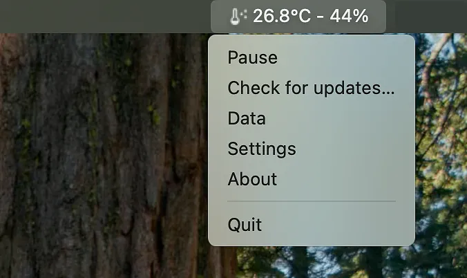

# SensorMenu (Electron)

SensorMenu is a standalone desktop application designed for macOS, Windows, and Linux, built with Electron. Its primary function is to connect to a local MQTT server, subscribe to a specific topic, and display real-time sensor data (temperature and humidity) directly in the system's menubar (macOS) or notification area (Windows/Linux).



## Features

*   **MQTT Integration:** Connects to a local MQTT broker and subscribes to a configurable topic (default: `esp32/dht22`) to receive JSON-formatted sensor data (e.g., `{"temp": "21", "hum": "49"}`).
*   **Real-time Data Display:** Displays the latest temperature and humidity data in the macOS menubar or Windows/Linux notification area.
*   **Menubar/Notification Area Integration:**
    *   **macOS:** Displays data in the format "dew_point_128 icon + temp °C - hum %" using `rumps`.
    *   **Cross-platform:** Provides a dropdown menu with options:
        *   Activate/Pause MQTT data stream
        *   Check for updates (placeholder)
        *   Settings (opens a dedicated window)
        *   About (opens a dedicated window)
        *   Quit
*   **Settings Window:** A dedicated window (`settings.html`) for configuring application behavior and MQTT connection parameters:
    *   Open at login (checkbox)
    *   Check for updates automatically (checkbox)
    *   Show icon in menubar (checkbox)
    *   Show temperature (checkbox)
    *   Show humidity (checkbox)
    *   MQTT broker IP (text input)
    *   MQTT broker port (numeric input)
    *   MQTT topic (text input)
    *   Restore default settings (button)
    *   Default MQTT configuration: `localhost:1883`, topic `esp32/dht22`.
*   **About Window:** A dedicated window (`about.html`) displaying app icon, name, version, and copyright information.

## Development Setup

To set up the development environment, follow these steps:

1.  **Clone the repository:**
    ```bash
    git clone https://github.com/antedoro/SensorMenu-electron.git
    cd SensorMenu(electron)
    ```
2.  **Install dependencies:**
    ```bash
    npm install
    ```

## Running in Development Mode

To run the application in development mode (with hot-reloading and developer tools), use the following command:

```bash
npm start
```

## Building the Application

To create a production-ready build of the application for your operating system, use the following command:

```bash
npm run build
```

This command will generate the distributable files in the `dist/` directory. For macOS, this typically creates a `.dmg` or `.app` file.

## macOS Installation and Troubleshooting

On macOS, Gatekeeper may block the application because it is not yet notarized by Apple. If you see a message that "SensorMenu" is damaged and can't be opened, you will need to manually bypass Gatekeeper.

Here's how:

1.  Open the `.dmg` file and drag `SensorMenu.app` to your `/Applications` folder.
2.  Open the Terminal and run this command:
    ```bash
    xattr -cr /Applications/SensorMenu.app
    ```
After running this command, you should be able to open the application.